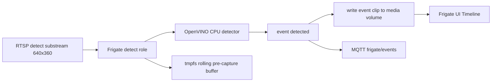
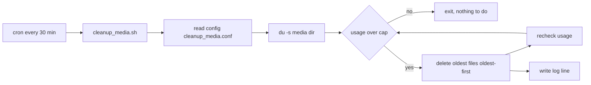

# Event-Only Video Recording + Disk-Cap Cleanup — Frigate NVR (Phase 0b)

## 1. Goal

1. Enable **event-based video clip recording** on all 10 cameras: Frigate records a
   short clip only when motion / a tracked object (person, car, later animals) is
   detected. No 24/7 continuous recording → **low CPU and disk**.
2. Add a **cron job** that deletes the oldest recordings whenever the media directory
   grows beyond a **config-controlled disk cap**, so disk usage never runs away even
   though Frigate's `retain.days` normally expires clips by age.

## 2. Context & Constraints

| Item | Value |
|---|---|
| Active config | [`config/config.yaml`](../config/config.yaml:1) — Frigate 0.17 reads `config.yaml` only |
| Stack | [`docker-compose.yml`](../docker-compose.yml:6) — Frigate + Mosquitto, `media/` volume already mounted |
| Host | Debian, Intel i7-9700 (8 cores), 7.5 GiB RAM, software decode only (VAAPI/QSV caused "Invalid data") |
| Detect streams | UNV `/media/video2` (640x360), Hikvision `/Streaming/Channels/102` — already `roles: [detect]` |
| Main streams | NOT pulled (that previously overwhelmed the CPU and produced invalid segments) |
| Media layout | Host `media/` = Frigate `/media/frigate`; recordings under `media/recordings/`, snapshots under `media/snapshots/`, exports under `media/clips/` |

## 3. Design Decisions

### 3.1 Record from the detect stream, not the main stream

In Frigate, when `record.enabled: true` and **no** camera input has a `record` role,
recordings are produced from the camera's `detect` stream. Frigate keeps a small
rolling pre-capture buffer in the tmpfs cache and writes a segment to the `media/`
disk volume **only when an event occurs**. This enables recording **without** adding
the high-res main streams back → no continuous high-res decode, no repeat of the
CPU / invalid-segment problem.



**Trade-off:** event clips are **low-res 640x360** (from the detect substream).
High-res main-stream clips remain deferred pending working hardware decode.

### 3.2 Disk-cap cleanup runs on the host via cron

Frigate's `record.retain.days` expires clips by **age**. The user wants a **disk-cap**
backstop: delete **oldest-first** when the media dir exceeds a configured size. The
cleanup runs as a **host cron job** (crontab) because the media bind-mount lives on the
host and Frigate itself cannot enforce a size cap. All tunables live in one config file
the user edits.



## 4. Changes

### 4.1 [`config/config.yaml`](../config/config.yaml:68) — replace the `record` block

Current:

```yaml
record:
  enabled: false
```

New:

```yaml
record:
  enabled: true
  retain:
    default: 7
    mode: active_objects
  events:
    pre_capture: 3
    retain:
      default: 7
      mode: active_objects
```

Notes:
- `mode: active_objects` keeps only segments where a tracked object is present
  (most disk-efficient). Use `mode: motion` for motion-without-object clips too.
- `pre_capture: 3` keeps ~3 seconds before the event start.
- `retain.default: 7` days; snapshots stay at 14 days.
- **No camera-block or compose changes** — `media/` is already mounted and the 1 GB
  tmpfs cache fits the 640x360 pre-capture buffer.

### 4.2 [`README.md`](../README.md:87) — update "recording disabled" section

Replace the Phase-0 "recording disabled" text: event-only recording is now enabled
from the detect substreams; clips are low-res (640x360); continuous/high-res recording
remains deferred pending hardware decode.

### 4.3 New: [`config/cleanup_media.conf`](../config/cleanup_media.conf) — cleanup tunables

```bash
# Media directory on the HOST (Frigate bind mount)
MEDIA_DIR=/home/dr/frigate/media

# Soft cap on media dir size in GB. Script deletes oldest files while over this cap.
MAX_MEDIA_GB=20

# Alternative cap: minimum free space on the media filesystem in GB.
# If free space drops below this, cleanup also runs (0 = disabled).
MIN_FREE_GB=5

# Belt-and-suspenders: also delete files older than this many days (0 = disabled).
MAX_AGE_DAYS=14

# Log file for cleanup runs
LOG_FILE=/home/dr/frigate/media-cleanup.log
```

Both `MAX_MEDIA_GB` and `MIN_FREE_GB` are configurable; `MIN_FREE_GB: 5` with
`MAX_MEDIA_GB: 20` means recordings can grow to 20 GB or until free disk hits 5 GB,
whichever fires first.

### 4.4 New: [`scripts/cleanup_media.sh`](../scripts/cleanup_media.sh) — cleanup script

Behavior:
- Sources `cleanup_media.conf`.
- Computes current `MEDIA_DIR` usage (`du -sk`) and free space on the filesystem (`df -kP`).
- If usage > `MAX_MEDIA_GB` **or** free < `MIN_FREE_GB`:
  - Lists all files under `MEDIA_DIR` oldest-first (`find ... -type f -printf '%T@ %p\n' | sort -n`).
  - Deletes oldest files (batch, then re-check) until under the cap and above min free.
  - Optionally deletes files older than `MAX_AGE_DAYS`.
- Guards: refuses to run if `MEDIA_DIR` is empty/unset; never follows symlinks; never
  targets `/`; writes one summary line per run to `LOG_FILE`.

### 4.5 New: crontab entry (documented in README + committed as `scripts/crontab.sample`)

```cron
# run every 30 minutes
*/30 * * * * /home/dr/frigate/scripts/cleanup_media.sh >> /home/dr/frigate/media-cleanup.log 2>&1
```

Install on the host with `crontab -e` (or `crontab scripts/crontab.sample`).

## 5. Deploy

```bash
# from this workspace
scp config/config.yaml config/cleanup_media.conf scripts/cleanup_media.sh \
    dr@debian:~/frigate/
ssh dr@debian chmod +x ~/frigate/scripts/cleanup_media.sh

# on the host
cd ~/frigate
docker compose restart frigate        # apply new record config
crontab scripts/crontab.sample        # install cleanup cron (or crontab -e)

# sanity-run the cleanup once
~/frigate/scripts/cleanup_media.sh
```

## 6. Verification Checklist

- [ ] `docker compose ps` shows `frigate` `Up` (restart clean, no config errors)
- [ ] Frigate UI (`http://<host-ip>:5000`) Timeline shows video clips on event triggers
- [ ] Event clips exist on disk: `find ~/frigate/media/recordings -type f | head`
- [ ] MQTT still publishes events; CPU stays low at idle (`docker stats frigate`)
- [ ] No persistent `ERROR` / "Invalid data" lines in `docker compose logs frigate`
- [ ] `cleanup_media.sh` runs once manually, logs a line, and reports usage vs cap
- [ ] `crontab -l` shows the cleanup entry; a manual run with a lowered
      `MAX_MEDIA_GB` deletes oldest files and usage drops back under the cap
