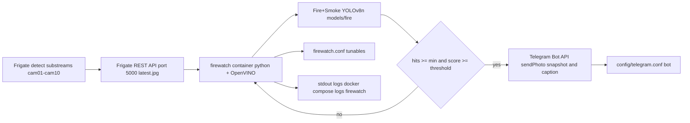

# Fire Detection via Fire-Watch Watcher — Frigate NVR

Goal: add **fire/smoke detection with direct Telegram photo alerts** to the existing
Frigate deployment, **without** touching the live person/car/animal detection pipeline
and **without** pulling the high-res main streams.

**Architecture (confirmed):** an external `firewatch` Docker service (Option A) that
reuses Frigate's already-decoded detect frames via the REST API and runs a dedicated
fire/smoke model. [`config/config.yaml`](../config/config.yaml) is **left untouched** —
no regression risk to current detection.

---

## 1. Answers to the original questions

### 1.1 How to enable fire detection
Frigate 0.17 has **no native fire/smoke class**: the bundled OpenVINO
`ssdlite_mobilenet_v2` is COCO-only, and Frigate assigns **one detector (one model) per
camera** — you cannot merge a second model's fire output into the running camera model.
Options considered:
- **Option A (chosen): external watcher.** A dedicated `firewatch` container polls each
  camera's latest detect frame from `http://frigate:5000/api/<cam>/latest.jpg` and runs
  a small fire/smoke YOLOv8n model (OpenVINO). On a sustained detection it sends a
  Telegram **photo** alert. Current person/animal detection is untouched.
- **Option B (later phase): native model swap.** Replace the sole detector with a
  union model containing fire + smoke + person + car + the tracked animals. Fully native
  (UI boxes, MQTT `frigate/events`, recorded clips) but needs a combined dataset, off-box
  training, and an NMS-free OpenVINO IR export — structurally identical to the pending
  animal Part-2 model in [`plans/animal-motion-detection.md`](animal-motion-detection.md).

### 1.2 Is the current stream sufficient?
**Yes for the AI inference itself.** Fire/smoke models downscale their input to ~640px, so
the 640x360 detect substream is enough — a higher-res input does not meaningfully improve
small-flame recall on this scene. The main streams (HEVC 3200x1800/2560x1440) were
intentionally dropped earlier because decoding them crashed ffmpeg and saturated the CPU
(see [`plans/event-only-recording.md`](event-only-recording.md)); we do **not** re-add them
for fire detection. The alert evidence image is the detect-stream snapshot returned by the
same `latest.jpg` endpoint, so no extra decode is introduced. A one-off main-stream frame
could be grabbed only at alert time later, if a sharper evidence image is ever wanted.

### 1.3 How to notify on Telegram directly
Telegram plumbing already exists for host monitoring: the git-ignored
[`config/telegram.conf`](../config/telegram.conf) holds `BOT_TOKEN` / `CHAT_ID`, and
[`monitor_lib.py`](../scripts/monitor_lib.py) has `send_telegram()` (text-only
`sendMessage`). For fire we need a **photo** alert, so we add
`send_telegram_photo(cfg, photo_bytes, caption)` (Bot API `sendPhoto`, stdlib multipart).
The `firewatch` watcher calls it directly — no MQTT hop required. A per-camera cooldown /
dedup prevents alert spam.

---

## 2. Context & constraints

| Item | Value |
|---|---|
| Stack | Frigate 0.17 + Mosquitto (Docker Compose), see [`docker-compose.yml`](../docker-compose.yml) |
| Active config | [`config/config.yaml`](../config/config.yaml) — **NOT modified by this task** |
| Host | Debian, Intel i7-9700 (8 cores), 7.5 GiB RAM — CPU/RAM constrained |
| Deploy path | Remote `/home/dr/frigate` via SSH user `ai` at `ssh.mazr3a.garden` (see `scripts/deploy_config.sh` + `.roo/rules/sshuser.md`) |
| Cameras | 10 detect substreams (UNV 640x360, cam08 Hikvision), detect `fps: 1` |
| Frigate API | `http://<host>:5000`; per-camera frame endpoint `GET /api/<cam>/latest.jpg` |
| Telegram creds | [`config/telegram.conf`](../config/telegram.conf) (git-ignored); real `BOT_TOKEN`/`CHAT_ID` must exist on the host |
| Fire model | Dedicated fire/smoke YOLOv8n → ONNX → OpenVINO IR under `models/fire/` |

---

## 3. Design decisions

1. **External watcher, not native.** One model per camera in Frigate makes native
   fire+existing detection impossible without a union retrain; the watcher avoids that
   cost and any regression to the working person/car/animal pipeline.
2. **`firewatch` is a compose service**, not a host cron job: self-contained, reproducible
   with the existing compose deploy, `restart: unless-stopped`, and it avoids installing an
   OpenVINO runtime on the host.
3. **Dependency-only image, runtime mounts.** The image contains only Python +
   `openvino` + `numpy`; `./scripts`, `./config`, `./models` are mounted read-only. Code or
   config changes therefore need **no image rebuild** — just a container restart.
4. **Reuse Frigate's decoded frames.** `latest.jpg` returns the frame Frigate already
   decodes for detection, so frame acquisition costs ~zero extra decode. The watcher's only
   added CPU is the (small) fire model inference at a low round-robin cadence.
5. **Fire vs smoke are separate tunables.** Smoke is false-positive-prone in a farm
   environment (steam, dust, haze, night IR artifacts), so the watcher starts with `fire`
   and `smoke` is disabled by default / enabled cautiously.
6. **Gating + cooldown.** An alert requires `min_hits` consecutive polls above
   `score_threshold` (reduces transient false positives), then a per-camera `cooldown_s`
   suppresses repeats.
7. **Direct Telegram photo alert.** No MQTT hop in this phase; a future phase may also
   publish `frigate/firewatch/<cam>` events for SQLite logging.

---

## 4. Architecture



---

## 5. Changes / deliverables

### 5.1 Acquire the fire/smoke model — `models/fire/`

The bundled COCO model has no fire class, so a dedicated model is required. Steps:

1. Select a public **fire + smoke YOLOv8** checkpoint (e.g. a Roboflow Universe
   "fire and smoke detection" model or a maintained GitHub release). Prefer
   `yolov8n` for CPU; note the chosen class order (usually `fire`, `smoke`).
2. Export to ONNX, then convert to OpenVINO IR:
   ```bash
   yolo export model=best.pt format=onnx            # NMS-free end-to-end
   mo --input_model best.onnx --output_dir ./openvino --compress_to_fp16
   ```
3. Place artifacts under this workspace:
   ```
   models/
   └── fire/
       ├── best.xml        # OpenVINO IR
       ├── best.bin
       └── labelmap.txt    # one class per line, index order = model order
   ```
4. Record the model's **input size** (e.g. 640x640) and source/license in this document's
   section 8 so it can be reproduced or swapped.

> The standalone watcher does its own NMS, so the export does **not** need Frigate's
> NMS-free `[1,N,6]` tensor constraint — a standard YOLOv8 export is fine.
>
> **Run [`scripts/prep_fire_model.sh`](../scripts/prep_fire_model.sh)`** to automate the
> `.pt` -> ONNX -> OpenVINO IR export and install `best.xml` / `best.bin` / `labelmap.txt`
> here. Concrete download sources (Roboflow Universe, GitHub Releases) and a train-your-own
> Colab fallback are documented in [`models/fire/README.md`](../models/fire/README.md).

### 5.2 Extend [`scripts/monitor_lib.py`](../scripts/monitor_lib.py)

Add a photo sender alongside the existing `send_telegram()`:
- `send_telegram_photo(cfg, photo_bytes, caption, parse_mode="html")` → Bot API
  `sendPhoto` using **stdlib** `urllib` + a small `multipart/form-data` body (no new
  third-party dependency for the container).
- Reuse `ensure_creds()`; raise a clear `RuntimeError` on API errors (mirrors the existing
  helpers). Do **not** change `send_telegram()` so the cron scripts keep working.

### 5.3 Write [`scripts/firewatch.py`](../scripts/firewatch.py)

Main loop (single process, round-robin over cameras):
- Read tunables from [`config/firewatch.conf`](../config/firewatch.conf).
- Load the OpenVINO model once (`MODEL_DIR/best.xml`).
- For each camera in `CAMERAS`: `GET {FRIGATE_API}/api/{cam}/latest.jpg` →
  decode JPEG → resize to the model input → normalize → infer.
- Track a per-camera rolling count of consecutive frames with a class (fire and/or smoke,
  per `TRACK_SMOKE`) above `SCORE_THRESHOLD`.
- When a camera reaches `MIN_HITS` consecutive hits **and** is outside its `COOLDOWN_S`
  window, fetch the snapshot bytes and send a Telegram photo alert with a caption:
  camera name, timestamp, class, confidence. Reset that camera's counter; start cooldown.
- Log every poll / alert / camera-offline to stdout (one line per camera per cycle at
  most, so logs stay readable via `docker compose logs firewatch`).
- Handle Frigate API failures per camera (skip, count consecutive errors, log when a
  camera comes back online); keep the loop alive on transient errors.
- A `--check` / `--once` mode prints model load + one frame result (useful for the deploy
  smoke test).

### 5.4 Add [`config/firewatch.conf`](../config/firewatch.conf)

Tunables (no secrets — this file is committed; edit on host if needed):

```bash
# Cameras to watch (comma-separated). Default: all 10.
CAMERAS=cam01,cam02,cam03,cam04,cam05,cam06,cam07,cam08,cam09,cam10

# Seconds to wait between polling a given camera (round-robin).
POLL_INTERVAL_S=15

# Frigate API base URL (inside compose network) and Telegram conf path.
FRIGATE_API=http://frigate:5000
TELEGRAM_CONF=/config/telegram.conf

# Model artifacts.
MODEL_DIR=/models/fire

# Minimum class score to count as a hit.
SCORE_THRESHOLD=0.5
# Consecutive hits required before alerting (false-positive guard).
MIN_HITS=3
# Seconds a camera stays silent after an alert.
COOLDOWN_S=300

# Track fire only (true) or fire + smoke (true also enables smoke).
TRACK_SMOKE=false
```

### 5.5 Add build files

- `firewatch/Dockerfile` — `python:3.11-slim`, `pip install -r requirements.txt`,
  non-root user, `ENTRYPOINT ["python", "/scripts/firewatch.py"]`.
- `firewatch/requirements.txt` — `openvino`, `numpy` (versions pinned).

No application code is baked into the image; `scripts/`, `config/`, `models/` are mounted
read-only (see 5.6).

### 5.6 Update [`docker-compose.yml`](../docker-compose.yml)

Add a `firewatch` service to the existing compose file:

```yaml
  firewatch:
    container_name: firewatch
    build: ./firewatch
    restart: unless-stopped
    volumes:
      - ./scripts:/scripts:ro
      - ./config:/config:ro
      - ./models:/models:ro
    environment:
      - FRIGATE_API=http://frigate:5000
      - TELEGRAM_CONF=/config/telegram.conf
      - FIREWATCH_CONF=/config/firewatch.conf
      - MODEL_DIR=/models/fire
    depends_on:
      - frigate
```

Notes:
- Same default compose network, so `firewatch` reaches Frigate at `frigate:5000`.
- No new host ports; the image is built on the host with `docker compose up -d --build`.

### 5.7 Create [`scripts/deploy_firewatch.sh`](../scripts/deploy_firewatch.sh)

Mirror the SSH_ASKPASS pattern of [`scripts/deploy_config.sh`](../scripts/deploy_config.sh)
(user `ai`, host `ssh.mazr3a.garden`, remote `/home/dr/frigate`):
1. `scp` `docker-compose.yml`, `firewatch/`, `scripts/`, `config/firewatch.conf`,
   `config/telegram.conf.example`, and `models/` to the remote deploy dir.
2. `docker compose up -d --build firewatch` (build happens on the host).
3. `docker compose ps` and a short log check.

---

## 6. Pre-deploy host facts to confirm (step 1 in the todo list)

Before implementation completes, confirm on the host (via SSH `ai@ssh.mazr3a.garden`):
- `config/telegram.conf` exists in `/home/dr/frigate/config/` with a **real** `BOT_TOKEN`
  and `CHAT_ID` (create a bot with @BotFather first if not; else copy the example and set
  values, then `scp` — it is git-ignored so it is never committed).
- `GET http://127.0.0.1:5000/api/<cam>/latest.jpg` returns a JPEG for each of the 10 cams
  (used by machine-status-style checks and reused here).
- Record the current CPU/RAM baseline (`docker stats frigate`) and the effective detector
  device from `GET /api/config` (`detectors.ov.device`) — note `config.yaml` currently says
  `device: GPU` while the README/host table says CPU; resolve the discrepancy before tuning
  CPU headroom.

---

## 7. Deploy (remote host)

```bash
# from this workspace
scripts/deploy_firewatch.sh

# then watch it come up (or run manually on the host)
cd /home/dr/frigate
docker compose up -d --build firewatch
docker compose logs -f firewatch
```

Because code/config are runtime mounts, later tweaks are:
```bash
scp scripts/firewatch.py config/firewatch.conf ai@ssh.mazr3a.garden:/home/dr/frigate/...
ssh ai@ssh.mazr3a.garden "cd /home/dr/frigate && docker compose restart firewatch"
```

---

## 8. Verification checklist

- [ ] `docker compose ps` shows `firewatch` `Up` (and `frigate` still `Up`)
- [ ] `docker compose logs firewatch` shows the model loaded and all 10 cameras polled
      with no persistent errors
- [ ] `--once` smoke test prints a valid inference on a live frame
- [ ] `docker stats` — firewatch CPU/RAM within budget; frigate CPU unchanged vs baseline
- [ ] Test Telegram **photo + caption** delivered to the group (send a deliberate test
      frame or temporarily lower `MIN_HITS`/`SCORE_THRESHOLD`)
- [ ] Cooldown works: no repeat alert for the same camera within `COOLDOWN_S`
- [ ] No regression: `docker compose logs frigate` shows no new `ERROR` lines and
      person/car/animal detection still fires as before
- [ ] `config/config.yaml` unchanged on the host (`md5sum` before/after)
- [ ] Model source + license recorded in this file (section 5.1 note)

---

## 9. Out of scope / deferred (future phases)

- Native fire/smoke via a union Frigate model (Option B) — combine with the animal Part-2
  model training.
- Publishing fire events to MQTT (`frigate/firewatch/<cam>`) for SQLite event logging.
- One-off high-res main-stream snapshot at alert time.
- Per-camera zones/masks restricting fire watch to fire-risk areas.

---

## 10. Git + remote handoff

- Commit after each logical change group (per `.roo/rules/Agents.md`), e.g.:
  (1) `monitor_lib` photo helper, (2) `firewatch.py` + `firewatch.conf` + Dockerfile +
  compose service, (3) deploy script, (4) this plan.
- After local changes are committed, hand off to the remote host via
  `scripts/deploy_firewatch.sh` and run the verification checklist there (per
  `.roo/rules/sshuser.md`).
