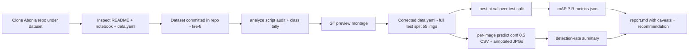

# Benchmark `models/fire/best.pt` on the Abonia YOLOv8 fire/smoke datasets

**Status:** ✅ implemented + recorded (2026-09-05). Full results:
[`dataset/abonia_eval/report.md`](../dataset/abonia_eval/report.md).

**Goal:** download the dataset(s) referenced by
`https://github.com/Abonia1/YOLOv8-Fire-and-Smoke-Detection` and run a reproducible,
local-CPU harness that measures how the active production checkpoint
[`models/fire/best.pt`](../models/fire/best.pt) (YOLO26-S, HF) performs on them —
mAP/P/R plus eyeball-able annotated results.

**Why this dataset:** the Abonia repo is the previously-superseded YOLOv8 fire/smoke
source (see [`models/fire/README.md`](../models/fire/README.md:77)). Its images are an
*independent* set from the checkpoint's own Roboflow training pool, so it is a useful
cross-check for the numbers in [`plans/fire-model-dataset-test.md`](fire-model-dataset-test.md:1)
(which benchmarks the *same* checkpoint on the other local Roboflow export,
`ready_fire_smoke_dataset`).

**Scope decision (user):** create a NEW plan file; leave
[`plans/fire-model-dataset-test.md`](fire-model-dataset-test.md:1) untouched; reuse that
plan's proposed eval-harness approach (scripts written generically so both benchmarks
can share them).

---

## 1. Repo + dataset context (confirmed by inspection)

| Item | Value |
|---|---|
| Repo | `github.com/Abonia1/YOLOv8-Fire-and-Smoke-Detection` (cloned `--depth 1` → `dataset/abonia_repo/`) |
| Dataset | **committed in the repo** (branch A) → `dataset/abonia_repo/datasets/fire-8/`; no external download, no Roboflow key |
| Origin | Roboflow Universe `custom-thxhn/fire-wrpgm` version 8; **CC BY 4.0** |
| Classes (dataset) | `Fire`(0), `default`(1), `smoke`(2) — `default` is a catch-all |
| Splits | train 877 imgs / valid 47 / test 55 — total 979 imgs, 1077 boxes |
| Class box tally | Fire 384, default 160, smoke 533 |
| Image size | 608×608 (Roboflow resize at export), no augmentation |
| Git | `dataset/*` git-ignored ([`.gitignore`](../.gitignore:39)) |

## 2. Runtime context (as implemented)

- Local CPU venv **`.venv/`** (Python 3.11): torch `2.14.0+cpu`, torchvision
  `0.29.0+cpu` (must match the `+cpu` torch or `torchvision::nms` is missing), ultralytics
  `8.4.140`. Added `.venv/` to [`.gitignore`](../.gitignore:30).
- Production semantics mirrored ([`scripts/firewatch.py`](../scripts/firewatch.py:272)):
  track `fire` (+`smoke` optionally), ignore `other`, conf ≥ 0.5, 640 input.

## 3. ⚠️ Key discovery — real class order is `fire / other / smoke`

The checkpoint's own metadata (authoritative) is **`{0: fire, 1: other, 2: smoke}`**, which
**contradicts** [`models/fire/README.md`](../models/fire/README.md:12) (`fire/smoke/other`)
and the remap premise of [`fire-model-dataset-test.md`](fire-model-dataset-test.md:32)
("dataset 2 → model 1").

Consequences (implemented accordingly):
- The Abonia dataset order (`Fire`=0, `default`=1, `smoke`=2) **already aligns** with the
  model → **NO label remap needed**; only a corrected `data.yaml` was required.
- ⚠️ If the deployed OpenVINO `labelmap.txt` uses `fire/smoke/other`, indices 1 and 2 are
  swapped vs this checkpoint. `fire`-only alerts (index 0) are unaffected, but before any
  `TRACK_SMOKE=true`, regenerate `labelmap.txt` in model order (`fire/other/smoke`) via
  [`scripts/prep_fire_model.sh`](../scripts/prep_fire_model.sh).
- [`fire-model-dataset-test.md`](fire-model-dataset-test.md:1) should be revisited before
  implementation (left untouched per scope).

## 4. Pipeline (as executed)

## 5. Deliverables & steps (all done, recorded in §7)

Generic scripts (dataset-root/out-parametrised, reusable by the other benchmark):

1. **`scripts/analyze_fire_dataset.py`** — audit splits, orphans, per-class tally, image
   dims; writes `dataset_summary.txt`, `class_map.json`, GT preview montage.
2. **`scripts/build_fire_eval_subset.py`** — writes a corrected `data.yaml` for a chosen
   split (in-place, no copies) or an optional stratified subset (`--limit`).
3. **`scripts/test_fire_model.py`** — `model.val()` (mAP@50 / mAP@50-95 / P / R,
   per-class via `ap_class_index`) + per-image predict (conf 0.5) CSV, detection-rate
   summary and annotated JPGs.

Eval artefacts under `dataset/abonia_eval/` (git-ignored): `download_summary.md`,
`dataset_summary.txt`, `class_map.json`, `preview/`, `eval/data.yaml`,
`results/{metrics.json, per_image.csv, detection_rate.csv, annotated/}` and
[`report.md`](../dataset/abonia_eval/report.md).

## 6. Results (headline, Abonia `fire-8` test split — 55 imgs / 57 boxes)

| Class (idx) | P | R | mAP@50 | mAP@50-95 |
|---|---|---|---|---|
| all | 0.525 | 0.416 | **0.405** | **0.142** |
| fire (0) | 0.561 | 0.514 | **0.462** | 0.144 |
| smoke (2) | 0.489 | 0.318 | **0.349** | 0.140 |
| other (1) | – (no GT in split) | | | |

Deploy view (conf 0.5): fire image recall **24/35 (68.6 %)**, smoke **7/21 (33.3 %)**,
fire FP 0/20, smoke FP 0/34, no clean images. Full interpretation + recommendation:
[`dataset/abonia_eval/report.md`](../dataset/abonia_eval/report.md).

## 7. Implementation log (per `.roo/rules/Agents.md`)

- **2026-09-05 — env:** created `.venv/` (py3.11, torch `2.14.0+cpu`, torchvision
  `0.29.0+cpu`, ultralytics `8.4.140`); added `.venv/` to `.gitignore`. Fixed
  torch/torchvision CPU wheel mismatch (PyPI torchvision lacked `torchvision::nms`).
  Verified `best.pt` loads; `.names = {0:fire,1:other,2:smoke}`.
- **2026-09-05 — download (branch A):** cloned `Abonia1/YOLOv8-Fire-and-Smoke-Detection`
  into `dataset/abonia_repo`; dataset committed at `datasets/fire-8` (979 imgs,
  train/valid/test, CC BY 4.0) → no external download. Recorded
  `dataset/abonia_eval/download_summary.md`.
- **2026-09-05 — scripts (generic):** wrote `analyze_fire_dataset.py`,
  `build_fire_eval_subset.py`, `test_fire_model.py`; py_compile clean.
- **2026-09-05 — analysis:** ran analyse → `dataset_summary.txt` (splits/class tally
  verified with Python audit) + `class_map.json` + 14 GT preview images.
- **2026-09-05 — eval build:** `build_fire_eval_subset.py --split test` → corrected
  `data.yaml` (indices align; no remap), val/test = full 55-image test split.
- **2026-09-05 — benchmark:** `test_fire_model.py` ran `val()` + per-image pass (conf
  0.5) + annotations. Fixed per-class metric extraction to use `ap_class_index` (initial
  version mislabeled smoke as `other`). Final numbers in §6.
- **2026-09-05 — report:** wrote `dataset/abonia_eval/report.md` (caveats, README
  class-order correction, keep-model recommendation).

## 8. Out of scope (future)

- Full-dataset run on `train/` or pooling `valid`+`test` for a larger sample.
- OpenVINO IR (`best.xml`) parity test with the exact `firewatch` decode path.
- Re-scoring the other local dataset (`ready_fire_smoke_dataset`) — belongs to
  [`fire-model-dataset-test.md`](fire-model-dataset-test.md:1).
- Fixing `models/fire/README.md` class order and any production `labelmap.txt` swap —
  flagged to the user as a recommended follow-up.
- Any change to the running `firewatch` service /
  [`config/firewatch.conf`](../config/firewatch.conf) unless a later on-camera pilot
  recommends it.

## 9. Git & remote handoff

- Commits made per logical group (plan, `.gitignore`, scripts); outputs under `dataset/*`
  stay untracked.
- Per [`.roo/rules/sshuser.md`](../.roo/rules/sshuser.md): **no remote transfer/test** —
  this benchmark is inherently local (dataset + `best.pt` live here). If the outcome
  triggers a firewatch/model or documentation change, that is handled/deployed/tested on
  `ssh.mazr3a.garden` as a separate step.
