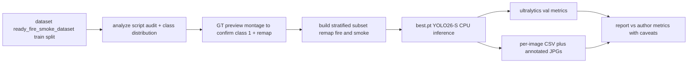

# Validate `models/fire/best.pt` on the local fire/smoke dataset

**Goal:** analyse the contents of the git-ignored [`dataset/`](../dataset) folder (Roboflow
fire/smoke export) and build a reproducible, local-CPU harness that runs the active fire
model [`models/fire/best.pt`](../models/fire/best.pt) against those images, producing both
benchmark metrics and eyeball-able annotated results.

**Scope decision (user):** run locally in a Python venv (PyTorch CPU + Ultralytics), on a
representative **subset first**, with an optional later full-dataset run.

---

## 1. Dataset content analysis (findings so far)

| Item | Value |
|---|---|
| Location | [`dataset/ready_fire_smoke_dataset.yolov8/`](../dataset/ready_fire_smoke_dataset.yolov8) + source zip [`dataset/ready_fire_smoke_dataset.yolov8.zip`](../dataset/ready_fire_smoke_dataset.yolov8.zip) |
| Format | Roboflow YOLOv8 export, license CC BY 4.0 (see [`README.dataset.txt`](../dataset/ready_fire_smoke_dataset.yolov8/README.dataset.txt:1)) |
| Origin | `universe.roboflow.com/a-nour/ready_fire_smoke_dataset-krwcc` (workspace `a-nour`) |
| Splits | **only `train/` present locally** — [`data.yaml`](../dataset/ready_fire_smoke_dataset.yolov8/data.yaml:1) points at `../valid/images` / `../test/images` which do **not** exist here |
| Classes | `nc: 3` but names were lost → `names: ['0','1','2']` ([`data.yaml`](../dataset/ready_fire_smoke_dataset.yolov8/data.yaml:5)); README describes content as *Fire / smoke / others* |
| Scale | [`README.roboflow.txt`](../dataset/ready_fire_smoke_dataset.yolov8/README.roboflow.txt:20) claims the project has 12,799 images; the actual local count must be measured by the analysis step |
| Git | `dataset/*` is git-ignored ([`.gitignore`](../.gitignore:36)) |

**Sampled label inspection (spot checks):**
- Label lines are standard YOLO `class cx cy w h` (normalized). Example:
  [`1_jpg.rf.Xtl9RgC8bcyilhlhkWu1.txt`](../dataset/ready_fire_smoke_dataset.yolov8/train/labels/1_jpg.rf.Xtl9RgC8bcyilhlhkWu1.txt:1) → class `2`.
- **Class mapping CONFIRMED by user visual inspection (2026-09-05):** dataset class
  `0` = **fire**, class `2` = **smoke**. Class `1` is unconfirmed (none seen in samples;
  likely the dataset `other` class or absent from this export) — the class tally in step 2
  settles whether class `1` exists at all.
- ⚠️ **Dataset class order ≠ model class order.** [`best.pt`](../models/fire/best.pt)
  expects `fire(0), smoke(1), other(2)`; the dataset labels fire as `0` and smoke as `2`.
  Labels **must be remapped** (dataset `2` → model `1`) before `model.val()` scoring, else
  smoke boxes are read as class `2` (`other`) and every metric is wrong.
- Geometry pattern observed: class `2` (smoke) is usually a large plume region; class `0`
  (fire) is one or more smaller flame regions. `Img_224` is all class `0` (fires).
- Some labels are **empty** (e.g. `olena-sergienko-0Ws...`, `oleg-mozhevin...` stock photos),
  and at least one image (`FireSmokeVideo31_f10`) had no readable label file during this
  inspection ⇒ image↔label pairing needs a programmatic audit, not assumptions.

**Source composition (by filename prefix):** `FireVideo*`, `FireSmokeVideo*`,
`NEWFireVideo*`, `VideoFire*`, `IncendiiSet2*`, `WEB*`, `Img_*`, `NoiseWEBSmoke*`,
`ck*`/numeric (web), and named `*-unsplash` stock photos ⇒ a mixture of fire / fire+smoke /
smoke video frames plus web & stock imagery — i.e. **generic internet fire data, not the
farm camera domain** (the model README already flags on-camera performance as unproven).

---

## 2. Model + runtime context

- [`models/fire/best.pt`](../models/fire/best.pt) is **YOLO26-S**, input 640, classes
  **`fire`(0), `smoke`(1), `other`(2)**; author-reported mAP@50 **94.9** / mAP@50-95 **68.0**
  / precision **89.6** / recall **88.8** ([`models/fire/README.md`](../models/fire/README.md:14)).
- Locally only the `.pt` exists — the OpenVINO IR the deployed `firewatch` uses
  (`best.xml`/`best.bin`/`labelmap.txt`) is not in this workspace.
- Production semantics to mirror ([`scripts/firewatch.py`](../scripts/firewatch.py:272)):
  filter to `fire` by default (optionally `fire,smoke`), **ignore `other`**, conf ≥ `0.5`,
  ultralytics-style letterbox to 640.
- Runtime needed here: **Ultralytics + PyTorch (CPU)** — not present in the `firewatch`
  image (OpenVINO only) and not installed on this machine yet.

---

## 3. Approach & decisions

1. **Local CPU venv**, subset-first. Install the CPU wheel of torch to avoid the multi-GB
   CUDA default, then `ultralytics` (a recent version that supports YOLO26).
2. **Class mapping is resolved, but remapping is mandatory.** User confirmed dataset
   `0 = fire`, `2 = smoke`; class `1` is likely `other` (verify via the class tally). Because
   this order differs from [`best.pt`](../models/fire/best.pt) (`fire=0, smoke=1, other=2`),
   labels are remapped before scoring: dataset `0`→`0` (fire), dataset `2`→`1` (smoke),
   dataset `1`→`2` (other). A small GT preview montage still confirms class `1` semantics
   and sanity-checks the remap before the full run.
3. **Score like firewatch uses the model**: remap GT to `fire`/`smoke` only, **drop `other`**
   ground truth (matches deployment `allowed`), conf 0.5, 640.
4. **Two complementary metric views:**
   - *Ultralytics `model.val()`* on a small remapped subset → mAP@50 / mAP@50-95 / P / R,
     directly comparable to the author-reported numbers.
   - *Deploy-oriented pass*: per-image predictions + annotated JPGs + a per-class
     detection-rate table → the intuitive answer to “does it find the fire in these images?”.
5. **Treat results as a generic benchmark, not on-camera proof**; overlap with the model's
   own training distribution (Roboflow fire data) is likely, so numbers are expected to be
   optimistic. The report recommends whether to trust the checkpoint or fine-tune on ~100-200
   own-camera frames (per [`models/fire/README.md`](../models/fire/README.md:20)).

---

## 4. Pipeline

---

## 5. Deliverables & steps

Working dir for outputs: **`dataset/eval/`** (already covered by `dataset/*` ignore). Venv:
**`.venv-firetest/`** at repo root (add one `.gitignore` line).

1. **Environment (step 1 of the todo list)**
   - `python3 -m venv .venv-firetest`, install CPU torch (`--index-url .../whl/cpu`) then
     `ultralytics` (YOLO26-capable). Add `.venv-firetest/` to [`.gitignore`](../.gitignore).
   - Load [`models/fire/best.pt`](../models/fire/best.pt) and print `.names` to confirm
     `['fire','smoke','other']` and that `.val`/`.predict` run on CPU.
2. **Dataset analysis** — new [`scripts/analyze_fire_dataset.py`](../scripts/analyze_fire_dataset.py)
   - Point at the dataset root; discover the YOLOv8 sub-dir; count images vs labels;
     report **orphan images** (no label) and **orphan labels** (no image); tally per-class
     box counts & images-per-class (this confirms whether class `1` exists); sample image
     dimensions via PIL; group by source prefix to characterise composition. Write a human
     summary to [`dataset/eval/dataset_summary.txt`](../dataset/eval/dataset_summary.txt).
3. **Class-map confirmation** — small preview generator (can live in the analyze script)
   - Mapping `0=fire`, `2=smoke` is already confirmed by the user; class `1` semantics are
     verified via the step-2 tally and a small GT preview montage (~10-14 images spanning
     sources: `FireVideo*`, `FireSmokeVideo*`, `*Smoke*`, `WEB*`, `Img_*`, unsplash; text =
     class ID, distinct colors per ID → [`dataset/eval/preview/`](../dataset/eval/preview/)).
     Record the final map in [`dataset/eval/class_map.json`](../dataset/eval/class_map.json)
     as `{"0":"fire","1":"other","2":"smoke"}` (or without `1` if it does not exist) for
     reuse by the subset builder and report.
4. **Build subset** — new [`scripts/build_fire_eval_subset.py`](../scripts/build_fire_eval_subset.py)
   - Stratify across source prefixes and class presence; target ~150-250 images containing
     `fire`, `smoke`, and `fire+smoke`, plus a few “other-only/negative” for realism.
     Copy images + write remapped YOLO labels (`fire`/`smoke`; `other` dropped by default,
     `--keep-other` flag) into `dataset/eval/subset/{images,labels}` and a matching
     `data.yaml` (`names: [fire, smoke]`).
5. **Run inference** — new [`scripts/test_fire_model.py`](../scripts/test_fire_model.py)
   - (a) `YOLO("models/fire/best.pt").val(data=subset/data.yaml)` → mAP/P/R table.
   - (b) `predict()` at conf 0.5 over the same images; write per-image CSV
     (`file,gt_fire,gt_smoke,det_fire,det_smoke,max_conf,...`), detection-rate summary, and
     annotated JPGs (GT + model boxes) to `dataset/eval/results/`.
6. **Report** — [`dataset/eval/report.md`](../dataset/eval/report.md)
   - Compare vs author metrics (94.9 / 68.0 / 89.6 / 88.8), note the class remap used, the
     dataset-domain mismatch, and likely training overlap; give a clear
     **keep / tune / fine-tune** recommendation for the firewatch threshold context.
7. **Wrap-up** — commit per logical group (per [`.roo/rules/Agents.md`](../.roo/rules/Agents.md));
   this task is inherently local (dataset + `best.pt` live here) so **no remote-host deploy is
   needed**; document optional follow-ups (full-dataset run; OpenVINO-IR parity once
   `best.xml` is generated via [`scripts/prep_fire_model.sh`](../scripts/prep_fire_model.sh)).

---

## 6. Out of scope (future)

- Full-dataset run (same harness, `--all`, CPU cost grows to potentially hours).
- OpenVINO IR (`best.xml`) parity test with the exact `firewatch` decode path.
- Producing/collecting own-camera frames for fine-tuning (a separate phase if the report
  recommends it).
- Any change to the running `firewatch` service / [`config/firewatch.conf`](../config/firewatch.conf)
  thresholds unless the report suggests tuning as a follow-up.

---

## 7. Git & remote handoff

- Commit after each logical change (per `.roo/rules/Agents.md`): (1) venv/gitignore + script
  scaffolding, (2) analysis + preview + class map, (3) subset builder + harness + report,
  (4) this plan.
- The outputs under `dataset/eval/` stay untracked (covered by `dataset/*`).
- Per [`.roo/rules/sshuser.md`](../.roo/rules/sshuser.md): no remote transfer/test required
  for this local benchmark; if the outcome triggers a firewatch threshold or model change,
  that change would be deployed/tested on `ssh.mazr3a.garden` as a separate plan.

---

## 8. Implementation log (2026-09-05)

### Status: DONE — local CPU benchmark produced under `dataset/eval/`

**Key deviation — no label remap was needed.** The plan (§3/§1) assumed
[`best.pt`](../models/fire/best.pt) was ordered `fire/smoke/other` and made remapping
"mandatory". Loading the checkpoint shows the real `.names` is
**`{0: fire, 1: other, 2: smoke}`** — identical to the dataset's confirmed order
(`0=fire`, `1=default/other`, `2=smoke`). So labels were scored as-is. This also matches
the class contract already encoded in the shared helpers
([`scripts/test_fire_model.py`](../scripts/test_fire_model.py),
[`scripts/build_fire_eval_subset.py`](../scripts/build_fire_eval_subset.py)).
`dataset/eval/class_map.json` records the final map.

**Unlabeled images:** of 12,799 `train/` images, 442 have an empty label file (0 boxes)
and were **excluded** from the eval subset (user instruction). 12,357 labeled images remain.

**Steps completed:**

1. **Env** — reused the existing local CPU venv `.venv/` (Python 3.11, torch 2.14 CPU,
   ultralytics 8.4.140) instead of creating `.venv-firetest/`; [`.gitignore`](../.gitignore)
   broadened to `.venv*`.
2. **Analysis** — [`scripts/analyze_fire_dataset.py`](../scripts/analyze_fire_dataset.py) run
   → [`dataset/eval/dataset_summary.txt`](../dataset/eval/dataset_summary.txt) (+ preview/,
   +class_map.json). Class box counts: fire 14,145 / other 3,796 / smoke 12,334; class `1`
   **does exist** (2,198 images).
3. **Class map** — [`dataset/eval/class_map.json`](../dataset/eval/class_map.json) +
   source-spanning GT preview montage in [`dataset/eval/preview/`](../dataset/eval/preview/).
4. **Subset** — [`scripts/build_fire_eval_subset.py`](../scripts/build_fire_eval_subset.py)
   updated to skip unlabeled images by default (`--include-unlabeled` opt-in) and accept
   `--names`; 200-image stratified labeled-only subset built under `dataset/eval/train/`
   + `dataset/eval/data.yaml`.
5. **Run** — [`scripts/test_fire_model.py`](../scripts/test_fire_model.py) → metrics +
   per-image CSV + annotated JPGs in [`dataset/eval/results/`](../dataset/eval/results/).
6. **Report** — [`dataset/eval/report.md`](../dataset/eval/report.md).

**Headline results (200-img subset):** all-class mAP@50 0.372 / fire 0.616 / smoke 0.307 /
other 0.194 (author-reported 0.949 is on the model's own validation — different
distribution). Deploy view (conf 0.5, image-level): fire recall **84.1%** (95/113), smoke
recall **41.7%** (48/115), fire FP 11/87, smoke FP 4/85. **Recommendation: keep the
checkpoint + 0.5 threshold for fire; do not fine-tune on this noisy off-domain export;
decide on an on-camera `--dry-run` pilot.** Full detail in the report.

**Commits:** `d8ceefc` (harness: gitignore + analyze unlabeled count + builder skip
unlabeled). Outputs under `dataset/eval/` are git-ignored (`dataset/*`). No production
`firewatch`/`config/firewatch.conf` change → **no remote-host deploy needed** (per
[`.roo/rules/sshuser.md`](../.roo/rules/sshuser.md)).

### Follow-up (2026-09-05) — curated-negatives FP audit

The 442 unlabeled images moved to `unlabelled-images-dir/` (git-ignored) were visually
triaged by the user: **430 are pure background/negatives**, grouped into
`unlabelled-images-dir/default-other/` (they contain no fire/smoke; "default/other" refers
to the dataset's catch-all class 1, but per user decision they stay **empty-label
background** samples — no class-1 boxes — and are used only to measure fire/smoke false
positives).

- **New helper** [`scripts/build_fire_negatives_eval.py`](../scripts/build_fire_negatives_eval.py)
  — copies the curated negatives into a self-contained `dataset/eval/negatives/{images,labels}`
  split with one empty `.txt` per image + a `fire/other/smoke` `data.yaml`.
- **FP audit** — [`scripts/test_fire_model.py`](../scripts/test_fire_model.py) over the 430
  negatives at conf 0.5: **fire FP 24/430 (5.6%)**, **smoke FP 2/430 (0.5%)**, `other`-only
  preds 41 (9.5%, ignored in production), any-pred 67 (15.6%), nothing 363 (84.4%).
  Fire-FP confs 0.51–0.89 (mostly sunset/warm-glow unsplash photos); stricter fire conf
  helps (≥0.7 → 2.6%, ≥0.8 → 1.6%). No image had both fire and smoke FP. Full detail in
  `dataset/eval/report.md` §7.
- **Commits:** this follow-up (`build_fire_negatives_eval.py` + plan note). Outputs under
  `dataset/eval/negatives/` are git-ignored (`dataset/*`). No production change → no
  remote-host deploy (per [`.roo/rules/sshuser.md`](../.roo/rules/sshuser.md)).
