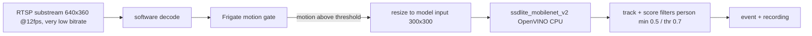
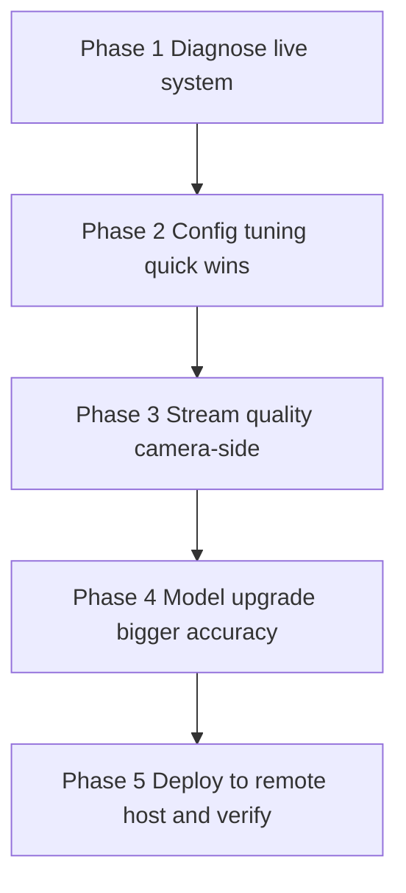

# Improve Person Detection & Recording Reliability — Frigate NVR

## 1. Problem

Users report:

1. **Missed detections/recordings** — many people walk in front of cameras and are
   neither detected nor recorded.
2. **Misleading detection overall** — the system flags things that are not people
   (false positives) and/or misses real people (false negatives).

Because the current policy is **event-only recording**
([`config/config.yaml`](../config/config.yaml:162)), a clip/snapshot is written *only*
when an event is created. Any failure in the detection pipeline → no event → no
recording. So "not recorded" is a downstream symptom of "not detected".

## 2. Root-cause analysis (from current config)

The current pipeline is intentionally minimal (Phase 0) and has several accuracy
limits that explain both symptoms:



| # | Limit | Effect on "missed" | Effect on "misleading" |
|---|---|---|---|
| 1 | Model `ssdlite_mobilenet_v2` at **300x300** input | Small/far persons shrink to ~20px in model input → weak for small objects → **missed** | Model is weak/coarse → wrong labels (animal→person) |
| 2 | `detect.fps: 5` | Fast movers fall between detection frames; if CPU can't keep up, frames are dropped | — |
| 3 | Motion gate `threshold:25` / `contour_area:10`, `improve_contrast:false` | Slow or far movement may never trigger the detector → **no event → no recording** | — |
| 4 | Person `min_score:0.5` / `threshold:0.7` | Small/far/IR-occluded persons score below → no event | High thresholds normally reduce FPs, but paired with a weak model they bias to misses |
| 5 | Substream bitrate ~100–230 kbps | Compression blurs small persons → model can't recognize → **missed** | Compression also creates false blob-like detections |
| 6 | No zones / masks | — | Detections fire anywhere in frame (trees, road, animal areas) → noise, "misleading" |
| 7 | Night/IR scenes (likely) | Low-light/IR degrades model accuracy further | IR noise → more false motion + mislabels |
| 8 | Event-only recording | Any of the above → no clip at all | — |

**Key insight:** because `detect.width/height` (640x360) and the model input (300x300)
cap the pixels-per-person, **source resolution matters only up to the model input
size**. The biggest accuracy levers are therefore:
- a stronger model with a **larger input** (more pixels on each person), and
- **cleaner source frames** (higher substream bitrate / resolution), plus
- a **more sensitive motion gate** so detection actually runs.

## 3. Plan overview (diagnostic-first)

Do **not** change anything until Phase 1 measures the live system. Each phase is
independent and can be accepted/rejected separately.



---

## Phase 1 — Diagnose the live system (NO config changes)

Run on the remote host (`ai@ssh.mazr3a.garden`) per the
[sshuser rule](../.roo/rules/sshuser.md). Capture a before-state so Phase 2/3/4
decisions are data-driven.

### 1.1 Collect per-camera stats
```bash
cd /home/dr/frigate
curl -s http://localhost:5000/api/stats | python3 -m json.tool
```
Record per camera: `camera_fps`, `process_fps`, `detection_fps`, `detection_enabled`,
`motion` counters. Interpretation:
- `detection_fps` is clearly **below** `process_fps` → **CPU-limited**; the i7-9700
  cannot run inference fast enough and frames are skipped → raise detection budget or
  drop detect.fps deliberately.
- `detection_fps` ≈ `process_fps` → CPU headroom exists; we can raise detect.fps and/or
  use a heavier model.
- `camera_fps` ≈ 0 or far below 12 → stream/decode problem on that camera.

### 1.2 Profile the events (false positives / negatives)
```bash
curl -s "http://localhost:5000/api/events?limit=200" | python3 -m json.tool
```
Count events by `label` and by camera:
- Many `person` events that are actually animals/foliage → FP problem on those cams.
- Almost no `person` events during busy daytime periods → FN problem (misses).
- Which cameras are silent → those are the cameras losing people.

### 1.3 Scan logs for drops/errors
```bash
docker compose logs --since 12h frigate 2>&1 | grep -iE "dropped|error|restart|watchdog" | tail -50
```
- `Frames dropped by detector` / `Ffmpeg process crashed` / `Detection appears to have
  stopped` → infrastructure issue, not tuning.

### 1.4 Day vs night gap
Compare event counts/`improve_contrast` behavior at night. If the system is essentially
empty at night → IR/low-light is the dominant cause and Phase 2 + Phase 4 are critical.

**Deliverable:** a short findings summary (stats table + event-label histogram + list of
silent cameras + CPU headroom verdict) that decides how aggressive Phase 2/4 can be.

### Phase 1 — Findings (2026-08-27, live host `ai@ssh.mazr3a.garden`)

**Infrastructure: healthy.** All 10 cameras have `detection_enabled: true`, `camera_fps ≈ 5`
(the `detect.fps: 5` cap), **0 dropped frames in the last 6h**, no watchdog/crash/decode
errors (the nginx `502 /auth` lines at 05:51 were transient startup noise). Detector
`inference_speed ≈ 14–16 ms`; frigate container ≈ **456% CPU (~4.5/8 cores)**, 1.9/7.5 GiB RAM.

1. **ZERO person events ever.** `/api/events` (492 total, the whole DB) labels:
   `sheep 259, horse 167, cat 33, bird 21, car 6, cow 4, dog 2` → **no `person` event at
   all**. People are missed 100% of the time.
2. **Motion gate never triggers on ~4 cameras.** Per-camera `detection_fps` ≈ `0.0`
   (cam02), `0.0` (cam08), `0.6` (cam09), `0.2` (cam10), `1.1` (cam05) **despite**
   `process_fps ≈ 4.5–5.1` — frames are processed but never reach the detector. With
   `motion.threshold: 25 / contour_area: 10 / improve_contrast: false`, moving persons on
   those cameras never cross the motion gate → no detection → no event → no recording.
   This is the primary cause on the entrance/perimeter cams.
3. **Model fails on persons even when detection runs.** cam04 (farm, tracks `person,car`
   only, `detection_fps 4.5`) and cam01 (`6.9`) run detection continuously yet produce
   zero person events → `ssdlite_mobilenet_v2` at 640×360 → 300×300 never returns a
   person ≥ `min_score 0.5` (small/far persons; weak model).
4. **Detection is CPU-limited.** `sum(detection_fps)=31.5` vs `sum(process_fps)=47.0`
   (≈33% of detect opportunities skipped). **Raising `detect.fps` to 10 would make this
   worse, not better** — confirmed by data, not just theory.
5. **"Misleading" = animal false-positive noise, largely already fixed.** Farm cams
   04/06/07 produced 478 of the 492 events (mostly sheep/horse) *before* the 08:51 local
   config reload set them to `person,car` only; since then they emit ≈0 — the override
   works. Remaining noise is cam01/cam02 animal detections (they still track all classes).
6. **Silent cameras (0 events ever):** cam03, cam05, cam09, cam10; cam02 & cam08 have 2
   each. These are the cameras to focus on for person capture.

**Implication for later phases:** Phase 2 must (a) make the motion gate fire on
cam02/05/08/09/10 (lower threshold/contour_area, `improve_contrast: true`), and
(b) lower the person filters (`min_score 0.35 / threshold 0.55`) to accept the model's
lower-confidence persons. Phases 3–4 address why the model fails on persons at all
(sharper streams + a stronger/larger-input model). FPS is **not** the lever.

---

## Phase 2 — Config tuning (quick wins, [`config/config.yaml`](../config/config.yaml))

Low-risk changes, no new model, no camera-side work. Apply after Phase 1 confirms the
patterns.

### 2.1 Loosen person detection thresholds
```yaml
objects:
  filters:
    person:
      min_score: 0.35
      threshold: 0.55
```
Rationale: small/far/IR persons score lower; current 0.5/0.7 biases to misses. If Phase 1
shows FPs dominating instead, keep `min_score` but raise `threshold` — the plan's default
targets the more common FN-heavy farm case, and masks (2.3) keep FPs in check.

### 2.2 Make the motion gate more sensitive
```yaml
motion:
  threshold: 15        # was 25 — more pixels count as motion
  contour_area: 5      # was 10 — smaller blobs trigger
  delta_alpha: 0.15    # was 0.2 — background adapts slower
  improve_contrast: true  # helps low-light / IR night scenes
```
This ensures slow/far movement actually hands a frame to the detector. If Phase 1 shows
noise-triggered FP motion, tighten back toward defaults on those cameras.

### 2.3 Cut false positives with masks/zones (only if Phase 1 shows FP cameras)
- **Motion/object masks** for foliage, road edges, and the animal pasture on cams 04–07
  so `person` cannot fire there:
  ```yaml
  cam04:
    motion:
      mask:
        - "0,0,640,0,640,100,0,100"   # example: ignore top band; draw real masks in UI
  ```
- Masks are best drawn interactively in the Frigate UI (Debug → mask editor), which
  writes the polygons back into the config.

### 2.4 Capture more of each event
```yaml
record:
  alerts:
    pre_capture: 5
    post_capture: 5
  detections:
    pre_capture: 5
    post_capture: 5
```
Longer pre/post capture means a clip starts before the person enters and ends after they
leave — reduces "I saw them but the clip cut it off".

### 2.5 Detection FPS (only if Phase 1 shows CPU headroom)
Raise `detect.fps` from 5 toward 7–10 on the cameras that miss fast movers — but only if
`detection_fps` was already tracking `process_fps`; otherwise this makes the CPU
bottleneck worse.

**Q: Will raising detect.fps to 10 improve detection?**
Only in one specific case: a person moving fast enough to slip between detection frames
(more frames = more recognition windows). It does **not** help small/far persons, the
motion gate (detector never triggered), low scores, compressed/blurred frames, or night/IR
accuracy — the dominant causes here. Risk: at 10 cameras × 10fps = 100 inferences/sec the
i7-9700 may saturate and **drop more frames**, hurting detection. So: bump fps only on the
cameras that lose fast movers, and only after Phase 1 confirms `detection_fps` already
equals `process_fps` at 5 (CPU headroom exists).

### 2.6 Night contrast tuning (if Phase 1 shows a night gap)
Add per-camera `motion.improve_contrast: true` (or keep global) and consider increasing
the substream bitrate at night via camera IR settings (Phase 3 overlap).

---

## Phase 3 — Stream quality (camera-side operator action + config)

Small objects are only as good as the pixels feeding the model. The substreams are
currently 640x360 at ~100–230 kbps (very compressed, see
[`camera-substream-report.md`](../camera-substream-report.md)).

### 3.1 Raise substream bitrate (all 10 cameras, camera web UI)
- UNV: substream `/media/video2` bitrate cap from ~120 kbps → **~600–1000 kbps**
  (CBR or higher VBR), keeping H.264 + U-Code off (already done in
  [`plans/improve-camera-substreams.md`](improve-camera-substreams.md)).
- Hikvision cam08: substream `/Streaming/Channels/102` same treatment.
- Less compression → sharper persons → better motion + object detection **even at the
  same model input size**.

### 3.2 Optionally raise substream resolution
- From 640x360 → **1280x720** (or 960x540) on cameras where persons appear small/far.
- **Must pair with** raising that camera's `detect.width`/`detect.height` in the config
  (else Frigate downscales to 640x360 before the model anyway) and a larger model input
  (Phase 4) to actually benefit.
- This costs CPU/RAM; enable only on the cameras that matter (Phase 1 identifies them).

---

## Phase 4 — Model upgrade (biggest accuracy lever, optional)

`ssdlite_mobilenet_v2` @ 300x300 is the fundamental accuracy ceiling. Replacing it with a
stronger model that also runs at a **larger input** (more pixels per person) is the single
biggest improvement for both missed persons and mislabels. Reuses the approach already
documented in [`plans/animal-motion-detection.md`](animal-motion-detection.md) (Part 2).

### 4.1 Candidate model
- **YOLOv8n** (or YOLOv8s if CPU allows) exported to **OpenVINO IR** with an **NMS-free**
  single output tensor `[1, N, 6]` (`class_id, confidence, x1, y1, x2, y2`) — Frigate's
  OpenVINO detector requirement.
- Input size: start at **416** (fast) or **640** (best small-object) — benchmark first.

### 4.2 CPU budget / detect.fps trade-off (must benchmark before committing)
On the i7-9700, OpenVINO inference of YOLOv8n @ 640 ≈ tens of ms/frame. With 10 cameras
that may exceed CPU capacity. Benchmark on the host first:
```bash
docker exec frigate /openvino/benchmark_app -m /models/best.xml -d CPU -api sync
```
Decide based on Phase 1 `detection_fps` headroom: keep `detect.fps: 5`, or reduce to 3, or
enable the heavy model only on the critical cameras (others keep the bundled model via a
per-camera `detect` override — or use `objects` scoping).

### 4.3 Config wiring (top-level `model:` block — 0.17 requirement)
```yaml
model:
  path: /models/person/best.xml
  labelmap_path: /models/person/labelmap.txt
  width: 640          # must match the custom model's real input
  height: 640

detectors:
  ov:
    type: openvino
    device: CPU
    model_path: /models/person/best.xml
```
Plus a `./models:/models:ro` volume in
[`docker-compose.yml`](../docker-compose.yml:26) and `objects.track` narrowed to the
labels the new model provides (e.g. keep `person`, `car`, farm animals only if wanted).

---

## Phase 5 — Deploy to remote host & verify (per the sshuser rule)

1. Edit files in this workspace (`config/config.yaml`, optionally `docker-compose.yml`,
   new model artifacts under `models/`).
2. Ask to move changes to the remote host and run test/verification there
   (`ai@ssh.mazr3a.garden`).
3. Deploy config: reuse/extend [`scripts/deploy_config.sh`](../scripts/deploy_config.sh)
   (scp → mv over `config/config.yaml.new` → `docker compose restart frigate`).
4. Verify:
   - `/api/config` shows the new model width/height and per-camera `detect`/`mask`.
   - `/api/stats` shows `detection_fps` tracking `process_fps` (CPU OK) and `camera_fps`
     ~12 on all cameras.
   - No `Invalid|Error|Safe mode|Detection appears to have stopped` in logs.
   - **Walk-test:** a person walking in front of each camera produces an event, a
     snapshot, and a clip (UI Timeline + `media/recordings`). Repeat at night for IR.
   - Compare event-label counts before vs after (Phase 1 baseline) — FPs should fall,
     daytime person events should rise.

## 4. Rollback

- Phase 2/5: restore the previous `config.yaml` from git and re-deploy (config-only,
  instant).
- Phase 3: revert camera bitrate/resolution in the camera web UI (no repo change).
- Phase 4: point `model.path` back to `/openvino-model/ssdlite_mobilenet_v2.xml` and
  remove the `./models` mount.

## Files touched

| File | Phase |
|---|---|
| [`config/config.yaml`](../config/config.yaml) | 2 (filters/motion/record/detect/masks), 3 (detect width/height), 4 (model block) |
| [`docker-compose.yml`](../docker-compose.yml) | 4 (models volume) |
| `models/person/best.xml` + `.bin` + `labelmap.txt` | 4 (new) |
| [`camera-substream-report.md`](../camera-substream-report.md) | 3 (re-probe bitrate/res) |
| [`scripts/deploy_config.sh`](../scripts/deploy_config.sh) | 5 (verify steps) |
| [`plans/animal-motion-detection.md`](animal-motion-detection.md) | reference (model export steps) |
