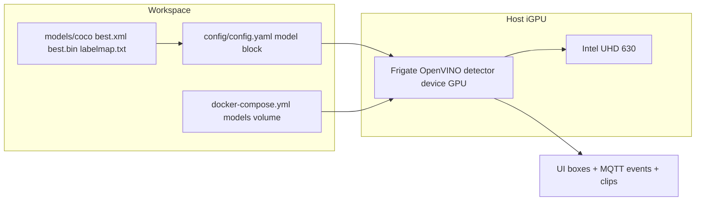

# Replace Bundled SSD with Lightweight COCO YOLO on the iGPU — Frigate NVR

> **Status:** PLANNED (not yet implemented)
>
> Goal: swap Frigate's bundled `ssdlite_mobilenet_v2` (COCO @ 300×300) for a lightweight
> Ultralytics COCO YOLO (`YOLO11n`, fallback `YOLOv8n`) exported to **OpenVINO IR**, run
> natively inside Frigate on the existing **Intel UHD 630 iGPU** (`device: GPU`). Detection
> stays fully native: UI boxes, tracker, MQTT `frigate/events`, and recorded event clips.

---

## 1. Why this is the right move

- The bundled SSD at 300×300 is the accuracy ceiling you already diagnosed: **zero `person`
  events ever**, animals mislabeled, small/far objects missed
  ([`plans/improve-person-detection.md`](improve-person-detection.md:108)).
- A YOLO COCO model is dramatically better on person/animal accuracy at the same or larger
  input, and is the same integration route your animal Part-2 plan already scoped as the
  native replacement ([`plans/animal-motion-detection.md`](animal-motion-detection.md:159)).
- The iGPU is **already deployed and healthy** for inference: OpenVINO `device: GPU`,
  `inference_speed` ≈ 9.85 ms, container CPU ≈ 23.67% after the switch
  ([`plans/use-igpu-to-reduce-cpu-load.md`](use-igpu-to-reduce-cpu-load.md:132)). We keep
  that `device: GPU` and only swap the model.

## 2. Current state (facts to preserve)

| Item | Value | Source |
|---|---|---|
| Frigate | 0.17.x, active config [`config/config.yaml`](../config/config.yaml:1) | `version: 0.17-0` at [config](../config/config.yaml:43) |
| Detector | OpenVINO, `device: GPU` (iGPU UHD 630) | [config](../config/config.yaml:105) |
| Model block | `/openvino-model/ssdlite_mobilenet_v2.xml`, labelmap `/labelmap.txt`, 300×300 | [config](../config/config.yaml:94) |
| Tracked (global) | person, car, dog, cat, bird, horse, sheep, cow | [config](../config/config.yaml:119) |
| Per-camera overrides | cam04–07 track person+car only; cam04–09 `fps: 1`, cam01–03 `fps: 2` | [config](../config/config.yaml:271) |
| Detect input | 640×360 substreams | [config](../config/config.yaml:226) |
| Compose volumes | frigate mounts `./config`, `./media`, tmpfs; **no `./models`** yet | [docker-compose.yml](../docker-compose.yml:30) |
| Deploy pattern | `scp` to `ai@ssh.mazr3a.garden:/home/dr/frigate`, `mv` over config, `docker compose up -d` | [deploy_config.sh](../scripts/deploy_config.sh:41) |
| Conversion pattern | `.pt` → ONNX (ultralytics) → OpenVINO IR (`ovc`), install `.xml/.bin/labelmap.txt` | [prep_fire_model.sh](../scripts/prep_fire_model.sh:37) |

## 3. Architecture



Constraints that MUST be respected (from verified prior work):

1. **One model per camera** — the new YOLO replaces the SSD for every camera; all labels must
   come from this one model (no merging a second model's output).
2. **Top-level `model:` block only** — Frigate 0.17 discards a per-detector `model:` block;
   set `path`/`labelmap_path`/`width`/`height` at top level, keep the flat `model_path:`
   on the detector as the override.
3. **`width`/`height` MUST equal the model's real input tensor** (the 320-vs-300 crash).
4. **Labelmap order = the model's class-index order**, and every label in `objects.track`
   must exist in that labelmap (Ultralytics COCO provides all of person/car/dog/cat/bird/
   horse/sheep/cow, so the current track lists stay valid unchanged).
5. Keep `version: 0.17-0` so the config migration never rewrites the file.

## 4. Model choice (decision, verify before commit)

| Candidate | Params | Notes |
|---|---|---|
| **YOLO11n @ 640** (preferred) | ~2.6M | Best accuracy/speed for the weak UHD 630; smallest of the modern line |
| YOLO11n @ 416 | ~2.6M | Lower accuracy on small/far objects but ~2× faster — fallback if 640 cannot keep up |
| YOLOv8n @ 640 | ~3.2M | Equally valid; baseline of all prior plans |

Rules:
- Use the **`n` (nano)** variant — `s` risks dropped frames when all 10 cameras fire on the
  iGPU, which is already slower than CPU for small models.
- Prefer **640** for small/far person & animal accuracy; drop to 416 **only** if the host
  benchmark shows `detection_fps` falling below `process_fps`.
- Any future union model (animals Part 2, fire Phase 1b) will replace this same model slot
  later; this step is the general COCO accuracy fix now.

## 5. Implementation steps

### Step 1 — Benchmark on the host before committing (data-driven)

Run on `ai@ssh.mazr3a.garden` per the sshuser rule, using the OpenVINO tooling inside the
running frigate container (OpenVINO 2025.3.0):

```bash
cd /home/dr/frigate
# baseline before any change
curl -s http://localhost:5000/api/stats | python3 -m json.tool   # detection_fps vs process_fps per cam
docker stats --no-stream frigate                                  # CPU/RAM baseline
docker exec frigate /openvino/benchmark_app -m /openvino-model/ssdlite_mobilenet_v2.xml -d GPU -api sync
```

Record: per-camera `detection_fps`/`process_fps`, `detection_fps` aggregate, container CPU,
baseline `inference_speed`. This decides whether 640 or 416 is safe. **Do not proceed to
deploy if the host shows dropped detect frames at the current SSD.**

### Step 2 — Produce the model artifacts into `models/coco/`

Create a working venv (`.venv/` is already git-ignored) with `ultralytics` + `openvino`
(Colab is the documented alternative — same cells as [`models/fire/README.md`](../models/fire/README.md:44)):

```bash
python3 -m venv .venv && . .venv/bin/activate
pip install -q ultralytics openvino
```

Export + convert (mirrors [`prep_fire_model.sh`](../scripts/prep_fire_model.sh:37), extended for
the full COCO labelmap and FP16 for the GPU):

```bash
# YOLO11n at the input size chosen in Step 1 (640 default)
yolo export model=yolo11n.pt format=onnx imgsz=640 opset=12   # NMS-free end-to-end export
# then OpenVINO IR, FP16 for iGPU
ovc yolo11n.onnx --output_model models/coco/best --compress_to_fp16
```

Write `models/coco/labelmap.txt` — **80 lines, exact Ultralytics COCO index order**:

```text
person
bicycle
car
motorcycle
airplane
bus
train
truck
boat
traffic light
fire hydrant
stop sign
parking meter
bench
bird
cat
dog
horse
sheep
cow
elephant
bear
zebra
giraffe
backpack
umbrella
handbag
tie
suitcase
frisbee
skis
snowboard
sports ball
kite
baseball bat
baseball glove
skateboard
surfboard
tennis racket
bottle
wine glass
cup
fork
knife
spoon
bowl
banana
apple
sandwich
orange
broccoli
carrot
hot dog
pizza
donut
cake
chair
couch
potted plant
bed
dining table
toilet
tv
laptop
mouse
remote
keyboard
cell phone
microwave
oven
toaster
sink
refrigerator
book
clock
vase
scissors
teddy bear
hair drier
toothbrush
```

Sanity-check before deploy (class order is critical — a wrong index swaps every label):

```bash
python3 -c "
from ultralytics import YOLO
m = YOLO('yolo11n.pt')
names = m.names
print(names[0], names[2], names[16], names[17], names[18], names[19])
# expect: person car dog horse sheep cow
"
```

Expected artifacts:

```text
models/coco/best.xml
models/coco/best.bin
models/coco/labelmap.txt
models/coco/README.md      # provenance + regeneration commands (like models/fire/README.md)
```

**Verify the export format against the running Frigate 0.17 build before full deploy** — the
OpenVINO detector expects an NMS-free single output tensor `[1, N, 6]`
(`class_id, confidence, x1, y1, x2, y2`). Ultralytics offers `format=frigate` for the
matching end-to-end export; confirm the exact accepted format for this container image (same
caution noted in [`plans/animal-motion-detection.md`](animal-motion-detection.md:167)). If the
plain end-to-end ONNX→IR shape is not accepted, re-export with `format=frigate` and re-run `ovc`.

### Step 3 — Extend `.gitignore` and add a README

- Add `models/coco/*.xml`, `models/coco/*.bin`, `models/coco/*.pt` (large, acquired once —
  only the README + labelmap stay tracked), mirroring the existing `models/fire/*` block in
  [`.gitignore`](../.gitignore:20).
- Add `models/coco/README.md` documenting model choice, provenance, license (YOLO11n is
  AGPL-3.0; **YOLOv8n is AGPL-3.0** too — confirm whether this is acceptable, otherwise pick
  a permissively-licensed equivalent) and the regeneration commands above.

### Step 4 — Mount the models dir into the frigate container

[`docker-compose.yml`](../docker-compose.yml:30) — add to the `frigate` service volumes
(exactly as scoped in the animal plan):

```yaml
    volumes:
      - ./config:/config
      - ./media:/media/frigate
      - ./models:/models:ro          # NEW: custom models
```

### Step 5 — Point the detector at the new model (config)

[`config/config.yaml`](../config/config.yaml:94) — replace the top-level `model:` block and
keep the detector device on the iGPU:

```yaml
model:
  path: /models/coco/best.xml
  labelmap_path: /models/coco/labelmap.txt
  width: 640                    # MUST match the model's real input (416 if downgraded)
  height: 640

detectors:
  ov:
    type: openvino
    device: GPU                 # unchanged - already verified working on the iGPU
    model_path: /models/coco/best.xml
```

Leave `objects.track` and per-camera overrides unchanged — all currently tracked labels
(person, car, dog, cat, bird, horse, sheep, cow) exist in the Ultralytics COCO labelmap.
Keep the existing per-class filters initially; YOLO confidence distributions differ from SSD,
so tune `min_score`/`threshold` only after observing the first day/night cycle (see
Verification, FP/FN comparison).

### Step 6 — Pre-deploy host facts (before touching the host)

Per the sshuser rule, confirm on `ai@ssh.mazr3a.garden`:
- `config/config.yaml` md5 + `/api/config` shows `detectors.ov.model.width == 300` (baseline
  to restore on rollback).
- `models/` dir exists / is creatable under `/home/dr/frigate/` and writable by `ai`.
- Record baseline `/api/stats` numbers from Step 1.
- Note which cameras are currently online (cam04–10 were unreachable at last re-verification —
  full-load verification must wait until all 10 are back).

### Step 7 — Deploy to remote host and verify (per the sshuser rule)

Extend/reuse the deploy pattern from [`deploy_config.sh`](../scripts/deploy_config.sh:41):

```bash
# from workspace
scp -r docker-compose.yml config models ai@ssh.mazr3a.garden:/home/dr/frigate/
# on host
cd /home/dr/frigate
docker compose up -d --force-recreate frigate
sleep 15
curl -s http://localhost:5000/api/config | python3 -m json.tool   # model path + width/height
curl -s http://localhost:5000/api/stats | python3 -m json.tool     # detection_fps vs process_fps
docker compose logs --since 3m frigate 2>&1 | grep -iE 'error|invalid|openvino|gpu|shape|labelmap' | tail -30
```

Accept criteria:
- `/api/config` shows `model.path == /models/coco/best.xml`, matching `width`/`height`,
  and detector `device: GPU`.
- No `ValueError ... broadcast` / `Detection appears to have stopped` in logs (input-size
  regression check).
- `sum(detection_fps)` tracks `sum(process_fps)` on all online cameras (no dropped frames).
- `inference_speed` stays comfortably under the frame budget.
- **Walk-test:** a person walking in front of each online camera produces an event with label
  `person`, a snapshot, and a clip (UI Timeline). Repeat at night for IR.
- Compare event-label counts before vs after: `person` events should appear (the old system
  produced zero), and animal mislabels (foliage/animal→person) should fall.
- Person detection accuracy regression: confirm `car`/animals still fire as before.

### Step 8 — Rollback path (documented, one command if needed)

```bash
# restore the known-good baseline on the host
cd /home/dr/frigate
# restore previous config.yaml (md5 from Step 6) and remove models/coco from use
docker compose up -d --force-recreate frigate
```
Config restore is a single `mv` over `config/config.yaml` (the file is md5-backed in Step 6);
no compose change is required to roll back since `./models` mounting is harmless when unused.

### Step 9 — Record results + git commit (per the Agents rule)

- After implementation and host verification, record the outcome (benchmark numbers, chosen
  model/input, observed FP/FN deltas, host facts) in **this file** under a "Results" section,
  matching how [`plans/use-igpu-to-reduce-cpu-load.md`](use-igpu-to-reduce-cpu-load.md:132)
  records verified results.
- Commit in logical groups: (1) plan file, (2) `models/coco/README.md` + `.gitignore`,
  (3) `config/config.yaml` + `docker-compose.yml`.

## 6. Verification checklist

- [ ] Step 1 benchmark recorded; decision 640 vs 416 justified
- [ ] `models/coco/` present with `best.xml`, `best.bin`, `labelmap.txt` (80 lines, COCO order)
- [ ] Model-load sanity check: class names resolve correctly (person/car/dog/horse/sheep/cow)
- [ ] Export format confirmed against the running Frigate 0.17 build (`[1, N, 6]` NMS-free)
- [ ] `.gitignore` covers `models/coco/*.xml|bin|pt`; README.md with provenance tracked
- [ ] [`docker-compose.yml`](../docker-compose.yml:30) mounts `./models:/models:ro`
- [ ] [`config/config.yaml`](../config/config.yaml:94) model block points to `/models/coco/`
      with matching width/height; `device: GPU` kept
- [ ] Deployed to host; `/api/config` and `/api/stats` meet accept criteria
- [ ] Walk-test person event + snapshot + clip (day and night/IR)
- [ ] Event-label comparison shows person events and fewer mislabels vs baseline
- [ ] Results recorded in this file; git commits made
