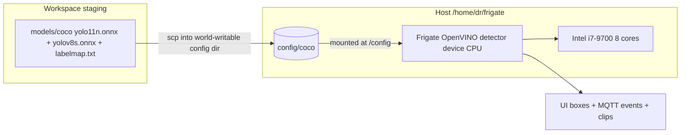

# Replace Bundled SSD with Lightweight COCO YOLO on CPU — Frigate NVR

> **Status:** IN IMPLEMENTATION (local edits done + committed; host baseline/benchmark in progress)
>
> Goal: swap Frigate's bundled `ssdlite_mobilenet_v2` (COCO @ 300×300) for a lightweight
> Ultralytics COCO YOLO, run natively inside Frigate. **Target device: `CPU`** (the i7-9700
> is a better YOLO target than the weak UHD 630 iGPU — see §1). Detection stays fully native:
> UI boxes, tracker, MQTT `frigate/events`, recorded clips.
>
> **Model decision is gated on a host benchmark** (`YOLO11n @ 640` vs `YOLOv8s @ 640`) —
> commit to whichever keeps `detection_fps` tracking `process_fps` on the CPU.

---

## 1. Why CPU (and not the iGPU) is the target

Your own measurements already show the **iGPU (UHD 630) is slower than the CPU even for the
tiny 300×300 SSD**: GPU 7.57 ms vs CPU 5.00 ms, live `inference_speed` ≈ 9.85 ms on GPU
([`plans/use-igpu-to-reduce-cpu-load.md`](use-igpu-to-reduce-cpu-load.md:54)). For a real YOLO
at 416–640 the iGPU (24 EU, shares system RAM with 10 decodes) would be the bottleneck, not
the enabler. The CPU — 8 real cores with AVX2 — is the stronger inference target here.

Why this is affordable now:
- Current `detect.fps` is **1–2 per camera** (was 5) and detection is **motion-gated**, so
  CPU inference demand is ~3–5× lower than the old ~456%-CPU baseline
  ([`config/config.yaml`](../config/config.yaml:229)).
- RAM (~7.5–8 GiB total) is **not** the binding constraint: an ONNX YOLO footprint is
  ~30–150 MB, far below the ~5 GiB headroom. The constraint is CPU seconds when many cameras
  detect simultaneously, mitigated by fps caps + per-camera `objects.track` scoping.
- What CPU unlocks over the iGPU: `nano` runs comfortably, and the accuracy-first **`s`
  variant becomes viable** (optionally INT8-quantized for ~2–3× CPU speedup).

Rule: benchmark on the live host **before** committing. Only fall back to `device: GPU` if
the CPU cannot keep `detection_fps` tracking `process_fps` when all 10 cameras are online.

## 2. Current state (facts to preserve)

| Item | Value | Source |
|---|---|---|
| Frigate | 0.17.x (0.17.2 container verified), active config [`config/config.yaml`](../config/config.yaml:1) | `version: 0.17-0` at [config](../config/config.yaml:43) |
| Detector | OpenVINO, currently `device: GPU` (iGPU UHD 630) — **to change to CPU** | [config](../config/config.yaml:105) |
| Model block | `/openvino-model/ssdlite_mobilenet_v2.xml`, labelmap `/labelmap.txt`, 300×300 | [config](../config/config.yaml:94) |
| Tracked (global) | person, car, dog, cat, bird, horse, sheep, cow | [config](../config/config.yaml:119) |
| Per-camera overrides | cam04–07 track person+car only; cam04–09 `fps: 1`, cam01–03 `fps: 2` | [config](../config/config.yaml:271) |
| Detect input | 640×360 substreams | [config](../config/config.yaml:226) |
| Host deploy user | `ai@ssh.mazr3a.garden`; in `docker` group; **cannot write `/home/dr/frigate/models`** (dr-owned); the **world-writable `config/` dir is the deploy path** | [`deploy_config.sh`](../scripts/deploy_config.sh:41) |
| Model location | host `config/coco/` → container `/config/coco/` (Frigate keeps models under `/config`, e.g. `model_cache/`) | — |

## 3. Architecture



### Key technical findings (verified against Frigate v0.17.2 source)

Reverse-engineered from the actual 0.17.2 container source (`frigate/config/config.py`,
`frigate/detectors/plugins/openvino.py`, `frigate/util/model.py`, `frigate/object_detection/base.py`)
so no assumptions remain:

1. **Config schema (0.17.2):** the detector's model comes from the **top-level `model:`
   block** (`model_config = self.model.model_dump(...)`); a per-detector `model:` block is
   discarded (`detector_config.model = None`); the detector's flat `model_path:` overrides
   only the path. This matches your repo's verified notes.
2. **YOLO is a first-class model type:** `model_type: yolo-generic` is in the OpenVINO
   detector's `supported_models`. Frigate runs the raw model and calls
   `post_process_yolo()`, which handles **NMS-free Ultralytics ONNX output** (`cxcywh` +
   class scores, either `[1, 4+nc, N]` or `[1, N, 4+nc]`), converts to xyxy, and applies its
   **own NMS** (`score 0.4`, `nms 0.4`).
3. **No OpenVINO IR conversion needed:** Frigate's OpenVINO runner loads the `.onnx`
   directly. The artifact is the standard Ultralytics **NMS-free ONNX export** (`imgsz` =
   model input, `opset=12`, NMS disabled).
4. **Input preprocessing is standard Ultralytics:** with `input_tensor: nchw` +
   `input_dtype: float`, Frigate transposes NHWC→NCHW and **divides by 255** (`/ 255` in
   `_transform_input`) → 0–1 RGB NCHW, exactly what Ultralytics weights expect. Default
   `input_pixel_format: rgb` is correct.

Constraints that MUST be respected:

1. **One model per camera** — the new YOLO replaces the SSD for every camera; all labels must
   come from this one model.
2. **`width`/`height` MUST equal the model's real input tensor** (the 320-vs-300 crash).
3. **Labelmap order = the model's class-index order**, and every label in `objects.track`
   must exist in it (Ultralytics COCO provides person/car/dog/cat/bird/horse/sheep/cow, so
   current track lists stay valid unchanged).
4. Keep `version: 0.17-0` so the config migration never rewrites the file.
5. **Deployable path is `/config/coco`** (host `config/coco/`, world-writable). `ai` cannot
   create `/home/dr/frigate/models`, and the model must be replaceable via the same
   `.new`+`mv` mechanism that deploys `config.yaml`. No `docker-compose.yml` change is needed
   (the frigate `./config:/config` mount already exposes it).

## 4. Model choice — benchmark-gated (decide, then commit)

| Candidate | Params | Accuracy vs SSD | CPU cost @ fps 1–2 (estimate, verify) |
|---|---|---|---|
| **YOLO11n @ 640** (safe default) | ~2.6M | Large jump | ~15–25 ms/inf — comfortable |
| **YOLOv8s @ 640** (accuracy-first) | ~11.2M | Biggest jump (small/far + night/IR) | ~35–70 ms/inf FP32; ~15–30 ms INT8 |

Decision rule:
- Benchmark **both on `device: CPU`** with the live `/api/stats` gate: pick the largest
  variant whose aggregate `detection_fps` keeps tracking `process_fps` on all online cameras.
- If `YOLOv8s` FP32 cannot keep up, either (a) drop to `YOLO11n @ 640`, or (b) **INT8-quantize
  the `s`** and re-benchmark — `s`-INT8 is the best accuracy/perf point on this CPU.
- If **no** CPU candidate tracks `process_fps` (e.g. all 10 cameras firing at once), fall back
  to `device: GPU` with `YOLO11n @ 640` as a documented, pre-decided contingency — not a new
  decision.
- Any future union model (animals Part 2, fire Phase 1b) replaces this same model slot later.

## 5. Implementation steps

### Step 1 — Baseline on the host (DONE in progress)

Run on `ai@ssh.mazr3a.garden` per the sshuser rule:
- `/api/config`: current detectors + model block (schema check).
- `/api/stats`: per-camera `camera_fps` / `process_fps` / `detection_fps` + detector
  `inference_speed`; aggregate `detection_fps`.
- `docker stats --no-stream frigate`: CPU/RAM.
- Frigate version from logs; note which cameras are online (cam04–10 were unreachable at last
  check — full-load verification must wait until all 10 are back).
- `md5sum config/config.yaml` (rollback reference).

### Step 2 — Produce candidate ONNX artifacts (DONE)

Local staging in `models/coco/` using the workspace venv:
- `yolo11n.onnx` (10.7 MB) and `yolov8s.onnx` (44.9 MB), both Ultralytics NMS-free ONNX @640,
  output shape `[1, 84, 8400]` (verified) — exactly what Frigate's `post_process_yolo` parses.
- `labelmap.txt`: 80 lines, exact Ultralytics COCO index order (tracked; sanity-check printed
  `person car dog horse sheep cow`).
- Regenerate anytime with [`scripts/prep_coco_model.sh`](../scripts/prep_coco_model.sh).
- **License:** Ultralytics weights are AGPL-3.0 (fine for self-hosted; see README).

### Step 3 — Host benchmark gate (in progress — decides model + device)

Copy `models/coco/*.onnx` + `labelmap.txt` into the world-writable host `config/coco/`
(container `/config/coco/`), then measure inference on the CPU (GPU reference optional) with
the OpenVINO tooling in the frigate container:

```bash
scp models/coco/*.onnx models/coco/labelmap.txt ai@ssh.mazr3a.garden:/home/dr/frigate/config/coco/
docker exec frigate /openvino/benchmark_app -m /config/coco/yolo11n.onnx -d CPU -api sync
docker exec frigate /openvino/benchmark_app -m /config/coco/yolov8s.onnx -d CPU -api sync
# reference only, if considering the GPU fallback:
docker exec frigate /openvino/benchmark_app -m /config/coco/yolo11n.onnx -d GPU -api sync
```

Decision (record in §Results): pick the largest candidate that keeps aggregate
`detection_fps` ≈ `process_fps` under a live trigger test (walk a person in front of several
cameras). If `yolov8s` FP32 is too slow but the budget fits, benchmark the INT8 `s`. Choose
`device: CPU` if the winner is affordable; `device: GPU` (with `yolo11n`) only if no CPU
candidate passes — pre-decided contingency.

### Step 4 — Deploy artifacts to the host

- `config/coco/` already exists/creatable (world-writable `config/`). scp ONNX + labelmap
  there (see Step 3).
- No `docker-compose.yml` change and no container restart is required for the artifact copy.
  (The frigate container already mounts `./config:/config`.)

### Step 5 — Point the detector at the chosen model (config)

[`config/config.yaml`](../config/config.yaml:94) — replace the **top-level** `model:` block
with the winner from Step 3 (example shown for `yolo11n`; use whichever basename won) and keep
the flat `model_path:` override on the detector:

```yaml
model:
  model_type: yolo-generic          # Frigate 0.17.2 OpenVINO YOLO path (post_process_yolo)
  path: /config/coco/<winner>.onnx
  labelmap_path: /config/coco/labelmap.txt
  width: 640                        # MUST match the export imgsz
  height: 640
  input_tensor: nchw                # Frigate transposes NHWC -> NCHW
  input_dtype: float                # Frigate divides by 255 -> 0..1 RGB (Ultralytics norm)

detectors:
  ov:
    type: openvino
    device: CPU                     # target; GPU only if the Step-3 contingency fires
    model_path: /config/coco/<winner>.onnx
```

Leave `objects.track` and per-camera overrides unchanged — all tracked labels exist in the
Ultralytics COCO labelmap. Keep existing per-class filters initially; YOLO confidence
distributions differ from SSD, so tune `min_score`/`threshold` after the first day/night cycle.

### Step 6 — Deploy config + verify on the host

Deploy `config/config.yaml` via the standard mechanism
([`deploy_config.sh`](../scripts/deploy_config.sh:41) — scp `.new` + `mv`, then
`docker compose up -d`), then:

```bash
cd /home/dr/frigate
docker compose up -d          # recreate frigate with the new config
sleep 15
curl -s http://localhost:5000/api/config | python3 -m json.tool   # model_type/path/width/height/device
curl -s http://localhost:5000/api/stats | python3 -m json.tool     # detection_fps vs process_fps
docker compose logs --since 3m frigate 2>&1 | grep -iE 'error|invalid|openvino|onnx|shape|labelmap|yolo' | tail -30
docker stats --no-stream frigate                                   # CPU/RAM after swap
```

Accept criteria:
- `/api/config` shows `model.model_type == yolo-generic`, `model.path ==
  /config/coco/<winner>.onnx`, matching `width`/`height`, and detector `device: CPU`.
- No detector errors in logs (input-size / labelmap / shape regression check).
- `sum(detection_fps)` tracks `sum(process_fps)` on all online cameras (no dropped frames);
  container CPU and RAM within budget (~8 GiB total host RAM).
- `inference_speed` stays comfortably under the frame budget.
- **Walk-test:** a person walking in front of each online camera produces an event with label
  `person`, a snapshot, and a clip (UI Timeline). Repeat at night for IR.
- Event-label comparison vs baseline: `person` events should appear (old system produced
  zero); animal mislabels (foliage/animal→person) should fall; car/animals still fire.

### Step 7 — Rollback path

```bash
# restore the known-good baseline on the host
cd /home/dr/frigate
# restore previous config.yaml (md5 from Step 1) -> device: GPU + ssdlite 300x300 (model_type ssd default)
docker compose up -d
```
Config restore is a single `mv` over `config/config.yaml` (md5-backed in Step 1); the extra
files in `config/coco/` are harmless when unused.

### Step 8 — Record results + git commit (per the Agents rule)

- After implementation and host verification, record the outcome (baseline + benchmark
  numbers, chosen model/device, observed FP/FN deltas, host facts) in **this file** under a
  "Results" section, matching how [`plans/use-igpu-to-reduce-cpu-load.md`](use-igpu-to-reduce-cpu-load.md:132)
  records verified results.
- Commit in logical groups: (1) plan + docs + prep script + `.gitignore` (done, `83d8844`),
  (2) `config/config.yaml` model-block + device change once the winner is chosen.

## 6. Verification checklist

- [ ] Step 1 host baseline + version + schema recorded (detection_fps/process_fps, CPU, RAM)
- [x] Both candidates exported: `models/coco/yolo11n.onnx`, `models/coco/yolov8s.onnx`
- [x] `labelmap.txt` present with 80 lines in exact COCO order; class sanity-check passed
- [ ] Host benchmark run on CPU (GPU reference optional); winner + device recorded
- [ ] ONNX + labelmap copied to host `config/coco/` (container `/config/coco/`)
- [ ] [`config/config.yaml`](../config/config.yaml:94) top-level `model:` uses
      `model_type: yolo-generic`, points to the winner, matching width/height,
      `input_tensor: nchw`, `input_dtype: float`; `device: CPU` (unless contingency fired)
- [ ] Deployed to host; `/api/config` and `/api/stats` meet accept criteria
- [ ] Walk-test person event + snapshot + clip (day and night/IR)
- [ ] Event-label comparison shows person events and fewer mislabels vs baseline
- [ ] Results recorded in this file; git commits made

## 7. Results (recorded after implementation)

> To be filled after host baseline + benchmark + deploy + verification on
> `ai@ssh.mazr3a.garden` — per the Agents rule.
